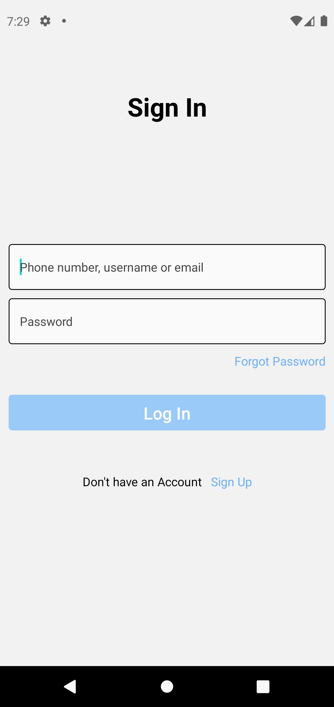
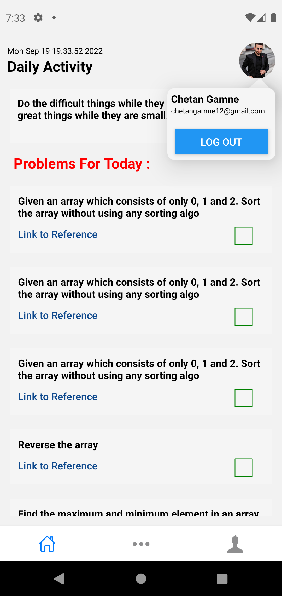
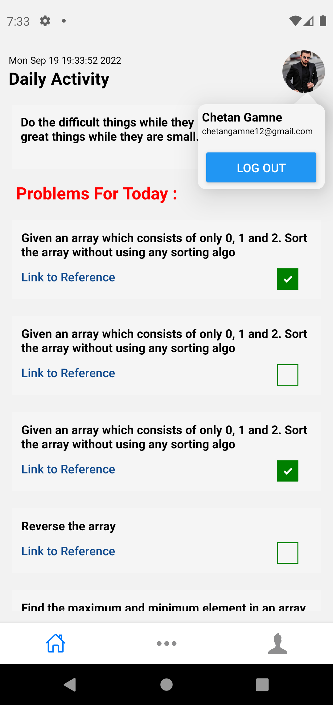
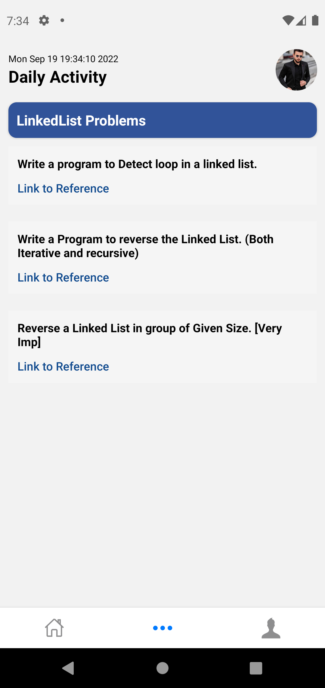
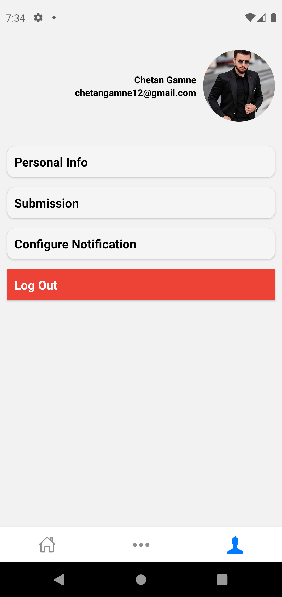

# DSATracker
React Native Application for DSA Tracking

## Application build in React native it has some features like complete authentication notification configuration
## I have used React-native,expo-notification,reduxjs-toolkit and firebase

    <table>
	    <tr>
    	    <td style="padding:10px">
        	    
      	    </td>
            <td style="padding:10px">
            	
            </td>
            <td style="padding:10px">
            	
            </td>
            <td style="padding:10px">
            	
            </td>
            <td style="padding:10px">
            	
            </td>
        </tr>
    </table>

